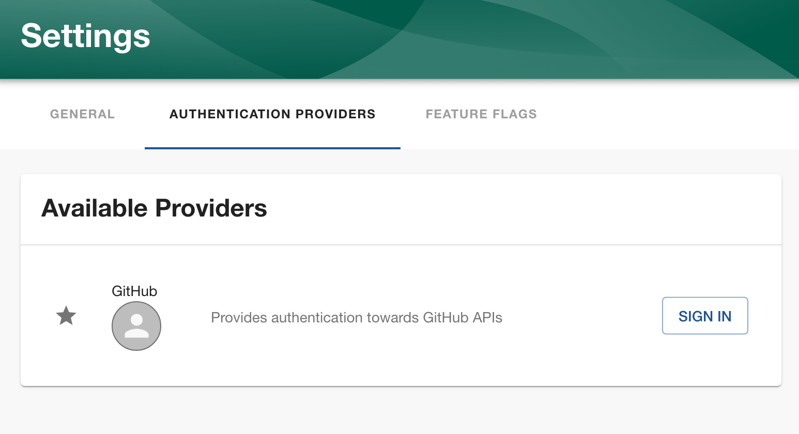

# IM GitHub Deployments Dashboard for Backstage

## What is the IM GitHub Deployments Dashboard

The IM GitHub Deployments Dashboard plugin works in conjunction with the [im-open/create-github-deployment] GitHub workflow action to create and track GitHub [deployments] and [deployment statuses].

## Getting started

### Update `catalog-info.yaml`

#### 1. `github.com/project-slug` - REQUIRED

The `catalog-info.yaml` file will need to be updated so that the `metadata.annotations` section contains a value for `github.com/project-slug`. The project slug is the GitHub owner and repository name separated by a forward slash, i.e., `im-open/im-github-deployments`.

```yaml
apiVersion: backstage.io/v1alpha1
kind: Component
metadata:
  name: im-github-deployemnts
  ...
  annotations:
    github.com/project-slug: im-open/im-github-deployments
```

#### 2. `deployment-environments` - OPTIONAL, but recommended

Adding the `metadata.deployment-environments` list allows the dashboard to be pre-populated with the expected deployment environments, and order their appearance in the dashboard.  Otherwise, the deployment environments will be ordered by how they were deployed and may not fully reflect the project deployment lifecycle.

```yaml
apiVersion: backstage.io/v1alpha1
kind: Component
metadata:
  name: im-github-deployemnts
  ...
  deployment-environments:
    - Dev
    - QA
    - Stage
    - Prod
  annotations:
    github.com/project-slug: im-open/im-github-deployments
```

### Backstage Installation:

#### 1. Add npm package

```bash
cd packages/app
yarn add @im-open/im-github-deployments
```

#### 2. Add to backstage catalog

In catalog `EntityPage.tsx` the reference to `@im-open/im-github-deployments` needs to be added and the plugin control needs to be added.

```bash
.
├── ...
├── packages
│   └── app
│       ├── ...
│       ├── src
│       │   └── components
│       │       └── catalog
│       │           ├── ...
│       │           └── EntityPage.tsx
│       ├── ...
│       └──
└── ...
```

```typescript
// imports
import { IMGitHubDeploymentsDashboard } from '@im-open/im-github-deployments';

...

const deploymentContent = (
  <Grid container spacing={3} alignItems="stretch">
    <Grid item xs={12} md={12} lg={12}>
      <IMGitHubDeploymentsDashboard />
    </Grid>
  </Grid>
};

...

const defaultEntityPage = (
  <EntityLayout>
    <EntityLayout.Route path="/" title="Overview">
      {overviewContent}
    </EntityLayout.Route>

    <EntityLayout.Route path="/deployments" title="Deployments">
     {deploymentContent}
    </EntityLayout.Route>

    <EntityLayout.Route path="/ci-cd" title="CI/CD">
      {cicdContent}
    </EntityLayout.Route>
    ...
  </EntityLayout>
);

...
```

The example adds the `import` statement and adds the `IMGitHubDeploymentDashboard` to the `defaultEntityPage`, but the display of the deployment tab can be based on whatever your catalog considers a deployable entity that is tied to a GitHub workflow.

#### 3. Authentication

The `im-github-deployments` plugin relies on GitHub authentication.  The user must have a GitHub login and access to the repository identified in the entity's `project-slug` annotation.



### Creating deployments via GitHub Workflows and Actions

#### Update deployment workflow to use the [im-open/create-github-deployment] action

After the deployment job, an `update-the-deployment-board` job can report back the results of the deployment.

```yaml
name: Project Deployment
on:
  workflow_dispatch:
    inputs:
      tag:
        description: The tag to deploy
        type: string
        required: true
      environment:
        description: The environment the branch, tag or SHA was deployed to
        required: true
        type: choice
        options:
          - Dev
          - QA
          - Stage
          - Prod
      instance:
        description: The instance to deploy to
        required: true
        type: choice
        options:
          - Primary-slot1
          - Primary-slot2
          - Secondary-slot1
          - Secondary-slot2

jobs:
  deploy-the-project:
    outputs:
      deployment_conclusion: ${{ steps.deployment.output.conclusion }}
  ...

  update-the-deployment-board:
  needs: [deploy-the-project]
  steps:
  - name: Create GitHub Deployment
        id: create-deployment
        uses: im-open/create-github-deployment@v1
        with:
          workflow-actor: ${{ github.actor }}
          token: ${{ secrets.GITHUB_TOKEN }}
          environment: ${{ input.environment }}
          release-ref: ${{ input.tag }}
          deployment-status: ${{ deploy-the-project.outputs.deployment_conclusion }}
          entity: im-github-deployments
          instance: ${{ input.instance }}

  ...
```

<!-- links -->

[im-open/create-github-deployment]: https://github.com/im-open/create-github-deployment "im-open/create-github-deployment"
[deployments]: https://docs.github.com/en/rest/deployments/deployments?apiVersion=2022-11-28 "Deployments: Use the REST API to create and delete deployments and deployment environments."
[deployment statuses]: https://docs.github.com/en/rest/deployments/statuses?apiVersion=2022-11-28 "Deployment statuses: Use the REST API to manage deployment statuses."
